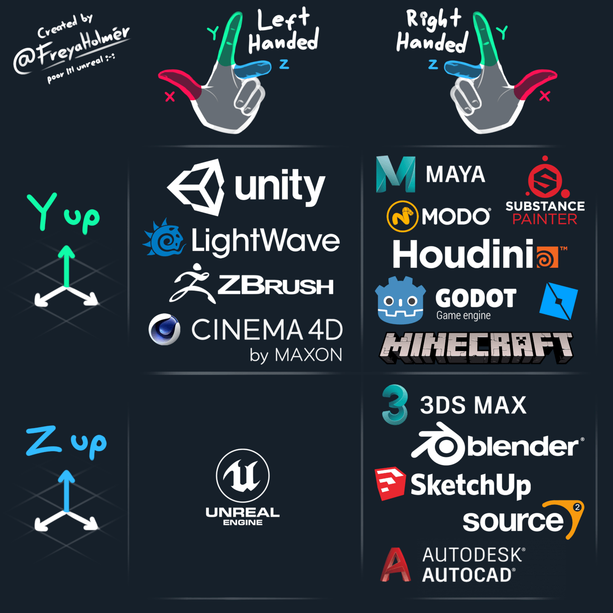
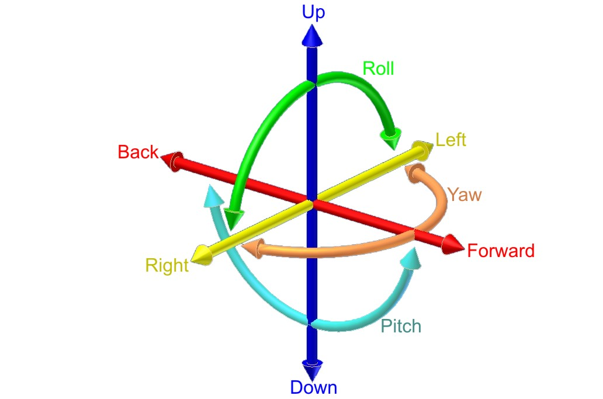

# Unity Engine Style Guide V4.0
Author: hoanglongplanner 

Organization: ViolettaLappy

Last Updated: 2023.10.09

# Table of Contents
- [Unity Engine Style Guide V4.0](#unity-engine-style-guide-v40)
- [Table of Contents](#table-of-contents)
- [Introduction](#introduction)
- [Standard Rules](#standard-rules)
- [Camelcase](#camelcase)
- [Variable Data Size](#variable-data-size)
- [Variable Naming](#variable-naming)
  - [Construction](#construction)
  - [Private Variable](#private-variable)
  - [Public Variable](#public-variable)
  - [Array](#array)
  - [List](#list)
  - [Int](#int)
  - [Signed Int](#signed-int)
  - [Unsigned Int](#unsigned-int)
  - [Float](#float)
  - [Double](#double)
  - [String](#string)
  - [Char](#char)
  - [Custom Class](#custom-class)
- [Function Method Naming](#function-method-naming)
- [Considerations](#considerations)
- [Removed Design](#removed-design)
  - [Common Design Pattern](#common-design-pattern)
- [DO NOT IN ANY CIRCUMSTANCES](#do-not-in-any-circumstances)
- [Feedback](#feedback)
- [References](#references)

# Introduction

This just a style guide for development in Unity Engine.

You don't need to uphold yourself to any standard, as long as you can work comfortable and get to the end product at the end.

The cons of using this style:
- Take more time to rewrite (which is not a good thing)
- NOT HUNGARIAN NOTATION BUT YET THE MINIMAL VERSION
- Your IDE is already good enough to deduce what type, if you hover the text (unless you use notepad)
- Explicit Heavy (break your fingers more)

Inspire by the following style guide:
- Google C++ Style Guide

Inspire by the following programming language:
- AngelScript
- Rust
- C++

It has been adopt in my own development, and in some public projects already. However this is still a stylize version.

If you use this and like it, please share to any fellow developers that may find good use of the knowledge. Please properly cite and credit to the original author.

# Standard Rules
- How you say it naturally, should be named as that. DO NOT FORCE NAMING.
- Minimize standard as much as you can be.
- Please try to avoid naming things with s character, it really is an OCD issue many times
- Avoid many technical debt by being flexible.

# Camelcase
CamelCase
SnakeCase

# Variable Data Size
It is good to refresh your knowledge, there are limitation in computer hardware regarding calculation and runtime.

# Variable Naming

## Construction

For variable:
- CollectionType_VariableType_VariableName
- CollectionType_VariableName 

EXAMPLE:
- sz_i32_enemyNumber;
- sz_enemyNumber;
- str_characterName;

For variable (with pointer):
- CollectionType_VariableType_pVariableName

EXAMPLE:
- i32_pEnemyNumber;
- m_pSomething;

## Private Variable
private variable start with _

## Public Variable
public variable is name freely for easily access

2 styles:
- public int Number;

## Array 

Normal Array:
- sz_somethingName
- sz_type_somethingName

Array in Array:
- szn_somethingName
- szn_type_somethingName

## List 

Normal List:
- list_something
- list_type_something

List in List:
- listn_something
- listn_type_something

## Int
- i8
- i16
- i32 (recommended, common use)
- i64
- i128
- i256
- i512

EXAMPLE:
- int i32_variableName;
- int i16_variableName;
- int int_variableName;

## Signed Int
- s8
- s16
- s32 (recommended, common use)
- s64
- s128
- s256
- s512

EXAMPLE:
- signed int s32_variableName;

## Unsigned Int
- u8
- u16
- u32 (recommended, common use)
- u64
- u128
- u256
- u512

EXAMPLE:
- unsigned int u32_variableName;

## Float
- f (recommended, common use)
- f32 (Rust style)
- f64 (Rust style)

## Double
- d (recommended, common use)

EXAMPLE:
- double d_variableName;

## String
- str

EXAMPLE:
string str_variableName;

## Char
- char

EXAMPLE:
- char char_variableName;

## Custom Class
- m

EXAMPLE:
- EnemyManager m_enemyManager;

# Function Method Naming

- public int SetNumber();
- public int GetNumber();

# Considerations

It is a maddening process to say which is X Y Z in 3D Space

Please just use Roll Pitch Yaw as standard when talking to others regarding 3D Space

# Removed Design

Name variable as following:
- int i_something; (confuse with interface class which has same prefix character i, hungarian style to avoid)
- int int_something; (too redundant)
- float float_something (too redundant)

## Common Design Pattern
- Composition
- Builder
- Singleton

# DO NOT IN ANY CIRCUMSTANCES
- Bad Naming Scheme

# Feedback
- If there are something that doesn't make sense, reach out to me

# References
- https://docs.godotengine.org/en/stable/tutorials/3d/introduction_to_3d.html
- https://mastodon.social/@acegikmo/109429307211544506
- https://simple.wikipedia.org/wiki/Pitch,_yaw,_and_roll
- https://github.com/ziglang/zig/issues/6417
- https://softwareengineering.stackexchange.com/questions/102689/what-is-the-benefit-of-not-using-hungarian-notation