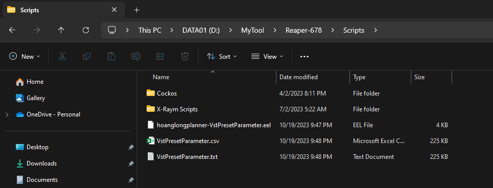

# Reaper VST Preset to CSV

// Add title image here

# Table of Contents
- [Reaper VST Preset to CSV](#reaper-vst-preset-to-csv)
- [Table of Contents](#table-of-contents)
- [Links](#links)
- [References](#references)
- [Introduction](#introduction)
- [Acknowledgement \& Disclaimer \& Limitation](#acknowledgement--disclaimer--limitation)
- [Video Showcase](#video-showcase)
- [CSV Showcase Old](#csv-showcase-old)
- [CSV Showcase New](#csv-showcase-new)
- [Code Breakdown](#code-breakdown)

# Links
- Repo
- EEL2 Original Script
- EEL2 New Script
- Blogger
- LinkedIn
- Link to PDF Format Pandoc

# References
- <https://www.cockos.com/EEL2/>
- <https://www.cockos.com/reaper/sdk/reascript/reascripthelp.html>
- <https://forum.cockos.com/showthread.php?t=180466>
- <https://forum.cockos.com/showthread.php?t=132627>

# Introduction

tldr: Use Reaper to get all parameters of a VST in the 1st track and export those values to CSV and TXT.

This script was written as ELL2 format that Reaper support. More info can be found at <https://www.cockos.com/EEL2/> with ReaScript API <https://www.cockos.com/reaper/sdk/reascript/reascripthelp.html>

Extract all exposed paramters that Reaper has

Available use cases
- Archive purpose the VST parameters, unable to read it for other side, render the proprietary format into useless.
- Use for other audio programs

Has following features
- Export FX Parameters into raw readable format text
- Export formats:
  - TXT
  - CSV

# Acknowledgement & Disclaimer & Limitation

This code was written by DarkStar or other users, on Reaper forum post. Test on Reaper 6.72.

To actually get the real preset
- It was encrypted as binary

There are some parameter functions that I'm currently not sure what about yet. (Steps, Context)

This script has a limitation, since this is just a wrapper script that use Reaper API calls to get these values publicly, which is not really the best way to know.
- This cannot turn into preset to be use in instrument.
- In order to really archive the real preset of specific plugin, it would have to be some kind of format that is readable in any text editors like this which anyone who use to manipulate data files (JSON, XML, even TXT) not giberish stuffs

Two types:
1. H2P like u-he Zebralette or XML like Izotope Trash 2
2. Gibberish Readable Binary Format like NMSV, FXP and FXB (FX Preset, FX Bank)

# Video Showcase

This is how it is supposed to work

# CSV Showcase Old

VST3i: Surge XT (Surge Synth Team) (2->6ch)

| PARAM ID | Name                    | Min   | Max   | Min Val Extreme | Middle Val Extreme | Max Val Extreme | Steps | Steps Small | Step Large | IsToggle | Value | Val Extreme | Value Normalize | Context Current | Context Middle             | Context Min      | Context Max        |
| -------- | ----------------------- | ----- | ----- | --------------- | ------------------ | --------------- | ----- | ----------- | ---------- | -------- | ----- | ----------- | --------------- | --------------- | -------------------------- | ---------------- | ------------------ |
| 227      | Character               | 00.00 | 01.00 | 00.00           | 00.50              | 01.00           | 00.00 | 00.00       | 00.00      | 00.00    | 00.50 | 00.50       | 00.50           | Neutral         | Neutral                    | Warm             | Bright             |
| 228      | A Octave                | 00.00 | 01.00 | 00.00           | 00.50              | 01.00           | 00.00 | 00.00       | 00.00      | 00.00    | 00.50 | 00.50       | 00.50           | 0               | 0                          | -3               | 3                  |
| 229      | A Pitch                 | 00.00 | 01.00 | 00.00           | 00.50              | 01.00           | 00.00 | 00.00       | 00.00      | 00.00    | 00.50 | 00.50       | 00.50           | 0.00 semitones  | 0.00 semitones             | -7.00 semitones  | 7.00 semitones     |
| 230      | A Portamento            | 00.00 | 01.00 | 00.00           | 00.50              | 01.00           | 00.00 | 00.00       | 00.00      | 00.00    | 00.00 | 00.00       | 00.00           | 0.000 s         | 0.125 s                    | 0.000 s          | 4.000 s            |
| 231      | A Play Mode             | 00.00 | 01.00 | 00.00           | 00.50              | 01.00           | 00.00 | 00.00       | 00.00      | 00.00    | 00.00 | 00.00       | 00.00           | Poly            | Mono (fingered portamento) | Poly             | Latch (monophonic) |
| 232      | A FM Routing            | 00.00 | 01.00 | 00.00           | 00.50              | 01.00           | 00.00 | 00.00       | 00.00      | 00.00    | 00.00 | 00.00       | 00.00           | Off             | 3 > 2 > 1                  | Off              | 2 > 1 < 3          |
| 233      | A FM Depth              | 00.00 | 01.00 | 00.00           | 00.50              | 01.00           | 00.00 | 00.00       | 00.00      | 00.00    | 00.33 | 00.33       | 00.33           | -24.00 dB       | -12.00 dB                  | -48.00 dB        | 24.00 dB           |
| 234      | A Osc Drift             | 00.00 | 01.00 | 00.00           | 00.50              | 01.00           | 00.00 | 00.00       | 00.00      | 00.00    | 00.00 | 00.00       | 00.00           | 0.00 %          | 50.00 %                    | 0.00 %           | 100.00 %           |
| 235      | A Noise Color           | 00.00 | 01.00 | 00.00           | 00.50              | 01.00           | 00.00 | 00.00       | 00.00      | 00.00    | 00.50 | 00.50       | 00.50           | 0.00 %          | 0.00 %                     | -100.00 %        | 100.00 %           |
| 236      | A Keytrack Root Key     | 00.00 | 01.00 | 00.00           | 00.50              | 01.00           | 00.00 | 00.00       | 00.00      | 00.00    | 00.47 | 00.47       | 00.47           | C4              | E4                         | C-1              | G9                 |
| 237      | A Volume                | 00.00 | 01.00 | 00.00           | 00.50              | 01.00           | 00.00 | 00.00       | 00.00      | 00.00    | 00.89 | 00.89       | 00.89           | -3.00 dB        | -18.00 dB                  | -inf dB          | 0.00 dB            |
| 238      | A Pan                   | 00.00 | 01.00 | 00.00           | 00.50              | 01.00           | 00.00 | 00.00       | 00.00      | 00.00    | 00.50 | 00.50       | 00.50           | 0.00 % (Center) | 0.00 % (Center)            | -100.00 % (Left) | 100.00 % (Right)   |
| 239      | A Width                 | 00.00 | 01.00 | 00.00           | 00.50              | 01.00           | 00.00 | 00.00       | 00.00      | 00.00    | 01.00 | 01.00       | 01.00           | 100.00 %        | 0.00 %                     | -100.00 %        | 100.00 %           |
| 240      | A Send FX 1 Level       | 00.00 | 01.00 | 00.00           | 00.50              | 01.00           | 00.00 | 00.00       | 00.00      | 00.00    | 00.00 | 00.00       | 00.00           | -inf dB         | -6.00 dB                   | -inf dB          | 12.00 dB           |
| 241      | A Send FX 2 Level       | 00.00 | 01.00 | 00.00           | 00.50              | 01.00           | 00.00 | 00.00       | 00.00      | 00.00    | 00.00 | 00.00       | 00.00           | -inf dB         | -6.00 dB                   | -inf dB          | 12.00 dB           |
| 242      | A Send FX 3 Level       | 00.00 | 01.00 | 00.00           | 00.50              | 01.00           | 00.00 | 00.00       | 00.00      | 00.00    | 00.00 | 00.00       | 00.00           | -inf dB         | -6.00 dB                   | -inf dB          | 12.00 dB           |
| 243      | A Send FX 4 Level       | 00.00 | 01.00 | 00.00           | 00.50              | 01.00           | 00.00 | 00.00       | 00.00      | 00.00    | 00.00 | 00.00       | 00.00           | -inf dB         | -6.00 dB                   | -inf dB          | 12.00 dB           |
| 244      | A Pitch Bend Up Range   | 00.00 | 01.00 | 00.00           | 00.50              | 01.00           | 00.00 | 00.00       | 00.00      | 00.00    | 00.09 | 00.09       | 00.09           | 2 semitones     | 12 semitones               | 0 semitones      | 24 semitones       |
| 245      | A Pitch Bend Down Range | 00.00 | 01.00 | 00.00           | 00.50              | 01.00           | 00.00 | 00.00       | 00.00      | 00.00    | 00.09 | 00.09       | 00.09           | 2 semitones     | 12 semitones               | 0 semitones      | 24 semitones       |
| 246      | A VCA Gain              | 00.00 | 01.00 | 00.00           | 00.50              | 01.00           | 00.00 | 00.00       | 00.00      | 00.00    | 00.50 | 00.50       | 00.50           | 0.00 dB         | 0.00 dB                    | -48.00 dB        | 48.00 dB           |
| 247      | A Velocity > VCA Gain   | 00.00 | 01.00 | 00.00           | 00.50              | 01.00           | 00.00 | 00.00       | 00.00      | 00.00    | 01.00 | 01.00       | 01.00           | 0.00 dB         | -24.00 dB                  | -48.00 dB        | 0.00 dB            |
| 248      | A Feedback              | 00.00 | 01.00 | 00.00           | 00.50              | 01.00           | 00.00 | 00.00       | 00.00      | 00.00    | 00.50 | 00.50       | 00.50           | 0.00 %          | 0.00 %                     | -100.00 %        | 100.00 %           |


# CSV Showcase New

VST3i: Surge XT (Surge Synth Team) (2->6ch)

| ID  | Name                    | Value Current | Value Middle | Value Min | Value Max | Context Current | Context Middle             | Context Min      | Context Max        |
| --- | ----------------------- | ------------- | ------------ | --------- | --------- | --------------- | -------------------------- | ---------------- | ------------------ |
| 000 | M1: -                   | 00.00         | 00.50        | 00.00     | 01.00     | 0.000000        | 0.000000                   | 0.000000         | 0.000000           |
| 001 | M2: -                   | 00.00         | 00.50        | 00.00     | 01.00     | 0.000000        | 0.000000                   | 0.000000         | 0.000000           |
| 002 | M3: -                   | 00.00         | 00.50        | 00.00     | 01.00     | 0.000000        | 0.000000                   | 0.000000         | 0.000000           |
| 003 | M4: -                   | 00.00         | 00.50        | 00.00     | 01.00     | 0.000000        | 0.000000                   | 0.000000         | 0.000000           |
| 004 | M5: -                   | 00.00         | 00.50        | 00.00     | 01.00     | 0.000000        | 0.000000                   | 0.000000         | 0.000000           |
| 005 | M6: -                   | 00.00         | 00.50        | 00.00     | 01.00     | 0.000000        | 0.000000                   | 0.000000         | 0.000000           |
| 006 | M7: -                   | 00.00         | 00.50        | 00.00     | 01.00     | 0.000000        | 0.000000                   | 0.000000         | 0.000000           |
| 007 | M8: -                   | 00.00         | 00.50        | 00.00     | 01.00     | 0.000000        | 0.000000                   | 0.000000         | 0.000000           |
| 008 | Send FX 1 Return        | 01.00         | 00.50        | 00.00     | 01.00     | 0.00 dB         | -18.00 dB                  | -inf dB          | 0.00 dB            |
| 009 | Send FX 2 Return        | 01.00         | 00.50        | 00.00     | 01.00     | 0.00 dB         | -18.00 dB                  | -inf dB          | 0.00 dB            |
| 010 | Send FX 3 Return        | 01.00         | 00.50        | 00.00     | 01.00     | 0.00 dB         | -18.00 dB                  | -inf dB          | 0.00 dB            |
| 011 | Send FX 4 Return        | 01.00         | 00.50        | 00.00     | 01.00     | 0.00 dB         | -18.00 dB                  | -inf dB          | 0.00 dB            |
| 012 | Global Volume           | 01.00         | 00.50        | 00.00     | 01.00     | 0.00 dB         | -24.00 dB                  | -48.00 dB        | 0.00 dB            |
| 013 | Active Scene            | 00.00         | 00.50        | 00.00     | 01.00     | 0               | 1                          | 0                | 1                  |
| 014 | Scene Mode              | 00.00         | 00.50        | 00.00     | 01.00     | Single          | Dual                       | Single           | Channel split      |
| 015 | Split Point             | 00.47         | 00.50        | 00.00     | 01.00     | C4              | E4                         | C-1              | G9                 |
| 016 | FX Disable              | 00.00         | 00.50        | 00.00     | 01.00     | -               | -                          | -                | -                  |
| 017 | Polyphony Limit         | 00.23         | 00.50        | 00.00     | 01.00     | 16              | 33                         | 2                | 64                 |
| 018 | FX Chain Bypass         | 00.00         | 00.50        | 00.00     | 01.00     | All FX          | No Send and Global FX      | All FX           | All FX Off         |
| 019 | FX A1 FX Type           | 00.00         | 00.50        | 00.00     | 01.00     | Off             | Airwindows                 | Off              | Spring Reverb      |
| 227 | Character               | 00.50         | 00.50        | 00.00     | 01.00     | Neutral         | Neutral                    | Warm             | Bright             |
| 228 | A Octave                | 00.50         | 00.50        | 00.00     | 01.00     | 0               | 0                          | -3               | 3                  |
| 229 | A Pitch                 | 00.50         | 00.50        | 00.00     | 01.00     | 0.00 semitones  | 0.00 semitones             | -7.00 semitones  | 7.00 semitones     |
| 230 | A Portamento            | 00.00         | 00.50        | 00.00     | 01.00     | 0.000 s         | 0.125 s                    | 0.000 s          | 4.000 s            |
| 231 | A Play Mode             | 00.00         | 00.50        | 00.00     | 01.00     | Poly            | Mono (fingered portamento) | Poly             | Latch (monophonic) |
| 232 | A FM Routing            | 00.00         | 00.50        | 00.00     | 01.00     | Off             | 3 > 2 > 1                  | Off              | 2 > 1 < 3          |
| 233 | A FM Depth              | 00.33         | 00.50        | 00.00     | 01.00     | -24.00 dB       | -12.00 dB                  | -48.00 dB        | 24.00 dB           |
| 234 | A Osc Drift             | 00.00         | 00.50        | 00.00     | 01.00     | 0.00 %          | 50.00 %                    | 0.00 %           | 100.00 %           |
| 235 | A Noise Color           | 00.50         | 00.50        | 00.00     | 01.00     | 0.00 %          | 0.00 %                     | -100.00 %        | 100.00 %           |
| 236 | A Keytrack Root Key     | 00.47         | 00.50        | 00.00     | 01.00     | C4              | E4                         | C-1              | G9                 |
| 237 | A Volume                | 00.89         | 00.50        | 00.00     | 01.00     | -3.00 dB        | -18.00 dB                  | -inf dB          | 0.00 dB            |
| 238 | A Pan                   | 00.50         | 00.50        | 00.00     | 01.00     | 0.00 % (Center) | 0.00 % (Center)            | -100.00 % (Left) | 100.00 % (Right)   |
| 239 | A Width                 | 01.00         | 00.50        | 00.00     | 01.00     | 100.00 %        | 0.00 %                     | -100.00 %        | 100.00 %           |
| 240 | A Send FX 1 Level       | 00.00         | 00.50        | 00.00     | 01.00     | -inf dB         | -6.00 dB                   | -inf dB          | 12.00 dB           |
| 241 | A Send FX 2 Level       | 00.00         | 00.50        | 00.00     | 01.00     | -inf dB         | -6.00 dB                   | -inf dB          | 12.00 dB           |
| 242 | A Send FX 3 Level       | 00.00         | 00.50        | 00.00     | 01.00     | -inf dB         | -6.00 dB                   | -inf dB          | 12.00 dB           |
| 243 | A Send FX 4 Level       | 00.00         | 00.50        | 00.00     | 01.00     | -inf dB         | -6.00 dB                   | -inf dB          | 12.00 dB           |
| 244 | A Pitch Bend Up Range   | 00.09         | 00.50        | 00.00     | 01.00     | 2 semitones     | 12 semitones               | 0 semitones      | 24 semitones       |
| 245 | A Pitch Bend Down Range | 00.09         | 00.50        | 00.00     | 01.00     | 2 semitones     | 12 semitones               | 0 semitones      | 24 semitones       |
| 246 | A VCA Gain              | 00.50         | 00.50        | 00.00     | 01.00     | 0.00 dB         | 0.00 dB                    | -48.00 dB        | 48.00 dB           |
| 247 | A Velocity > VCA Gain   | 01.00         | 00.50        | 00.00     | 01.00     | 0.00 dB         | -24.00 dB                  | -48.00 dB        | 0.00 dB            |
| 248 | A Feedback              | 00.50         | 00.50        | 00.00     | 01.00     | 0.00 %          | 0.00 %                     | -100.00 %        | 100.00 %           |
| 249 | A Filter Configuration  | 01.00         | 00.50        | 00.00     | 01.00     | Wide            | Dual 2                     | Serial 1         | Wide               |
| 250 | A Filter Balance        | 00.50         | 00.50        | 00.00     | 01.00     | 0.00 %          | 0.00 %                     | -100.00 %        | 100.00 %           |
| 251 | A Highpass              | 00.00         | 00.50        | 00.00     | 01.00     | 6.88 Hz         | 84.82 Hz                   | 6.88 Hz          | 1046.50 Hz         |
| 252 | A Waveshaper Type       | 00.00         | 00.50        | 00.00     | 01.00     | Off             | Additive 12345             | Off              | Soft Single Fold   |
| 253 | A Waveshaper Drive      | 00.50         | 00.50        | 00.00     | 01.00     | 0.00 dB         | 0.00 dB                    | -24.00 dB        | 24.00 dB           |
| 254 | A Filter 2 Offset Mode  | 00.00         | 00.50        | 00.00     | 01.00     | Off             | Off                        | Off              | On                 |
| 255 | A Link Resonance        | 00.00         | 00.50        | 00.00     | 01.00     | Off             | Off                        | Off              | On                 |
| 256 | A Osc 1 Type            | 00.00         | 00.50        | 00.00     | 01.00     | Classic         | FM2                        | Classic          | Alias              |
| 257 | A Osc 1 Octave          | 00.50         | 00.50        | 00.00     | 01.00     | 0               | 0                          | -3               | 3                  |
| 258 | A Osc 1 Pitch           | 00.50         | 00.50        | 00.00     | 01.00     | 0.00 semitones  | 0.00 semitones             | -7.00 semitones  | 7.00 semitones     |
| 259 | A Osc 1 Shape           | 00.50         | 00.50        | 00.00     | 01.00     | 0.00 %          | 0.00 %                     | -100.00 %        | 100.00 %           |
| 260 | A Osc 1 Width 1         | 00.50         | 00.50        | 00.00     | 01.00     | 50.00 %         | 50.00 %                    | 0.00 %           | 100.00 %           |
| 261 | A Osc 1 Width 2         | 00.50         | 00.50        | 00.00     | 01.00     | 50.00 %         | 50.00 %                    | 0.00 %           | 100.00 %           |
| 262 | A Osc 1 Sub Mix         | 00.00         | 00.50        | 00.00     | 01.00     | 0.00 %          | 50.00 %                    | 0.00 %           | 100.00 %           |
| 263 | A Osc 1 Sync            | 00.00         | 00.50        | 00.00     | 01.00     | 0.00 semitones  | 30.00 semitones            | 0.00 semitones   | 60.00 semitones    |
| 264 | A Osc 1 Unison Detune   | 00.10         | 00.50        | 00.00     | 01.00     | 10.00 cents     | 50.00 cents                | 0.00 cents       | 100.00 cents       |
| 265 | A Osc 1 Unison Voices   | 00.00         | 00.50        | 00.00     | 01.00     | 1 voice         | 9 voices                   | 1 voice          | 16 voices          |
| 266 | A Osc 1 Keytrack        | 01.00         | 00.50        | 00.00     | 01.00     | On              | Off                        | Off              | On                 |
| 267 | A Osc 1 Retrigger       | 00.00         | 00.50        | 00.00     | 01.00     | Off             | Off                        | Off              | On                 |
| 268 | A Osc 2 Type            | 00.00         | 00.50        | 00.00     | 01.00     | Classic         | FM2                        | Classic          | Alias              |
| 269 | A Osc 2 Octave          | 00.50         | 00.50        | 00.00     | 01.00     | 0               | 0                          | -3               | 3                  |
| 270 | A Osc 2 Pitch           | 00.50         | 00.50        | 00.00     | 01.00     | 0.00 semitones  | 0.00 semitones             | -7.00 semitones  | 7.00 semitones     |
| 271 | A Osc 2 Shape           | 00.50         | 00.50        | 00.00     | 01.00     | 0.00 %          | 0.00 %                     | -100.00 %        | 100.00 %           |
| 272 | A Osc 2 Width 1         | 00.50         | 00.50        | 00.00     | 01.00     | 50.00 %         | 50.00 %                    | 0.00 %           | 100.00 %           |
| 273 | A Osc 2 Width 2         | 00.50         | 00.50        | 00.00     | 01.00     | 50.00 %         | 50.00 %                    | 0.00 %           | 100.00 %           |
| 274 | A Osc 2 Sub Mix         | 00.00         | 00.50        | 00.00     | 01.00     | 0.00 %          | 50.00 %                    | 0.00 %           | 100.00 %           |
| 275 | A Osc 2 Sync            | 00.00         | 00.50        | 00.00     | 01.00     | 0.00 semitones  | 30.00 semitones            | 0.00 semitones   | 60.00 semitones    |

# Code Breakdown

The code below will initialise and set the values by using provided Reaper API functions, in this case we only want to get parameter values from the 1st track only.

```c
RV = TrackFX_GetFormattedParamValue(tr, 0, Pidx, #form_pv);
pval = TrackFX_GetParam(tr, 0, Pidx,  minval, maxval);
pval_ex = TrackFX_GetParamEx(tr, 0, Pidx, minval_ex, maxval_ex, midval_ex);
pval_norm  = TrackFX_GetParamNormalized(tr, 0, Pidx);
RV = TrackFX_GetParameterStepSizes(tr, 0, Pidx, step, smallstep, largestep, istoggle);
```

The code below will get parameter values (different than context value), round and automatically append these values into #pv2 array
- min
- max
- middle
- step (how much to increase and decrease knob, 0.1 0.01 0.001) (DISCARD)
- isToggle (in theory it should only be 0 or 1) (DISCARD)
- contextValue

Note: DISCARD meaning it won't be present in the new script, I discard these value because they are not any significant at all

```c
// ! ORIGINAL VERSION
sprintf(#pv2,"%05.2f, %05.2f, %05.2f, %05.2f, %05.2f, %05.2f, %05.2f, %05.2f, %05.2f,%05.2f, %05.2f, %05.2f,\ ", 
                       minval, maxval, minval_ex, midval_ex, maxval_ex,
                       step, smallstep, largestep, istoggle, 
                       pval, pval_ex, pval_norm );
```

```c
// ! NEW VERSION
sprintf(#pv2,
  "%05.2f, %05.2f, %05.2f, %05.2f,\ ", 
  pval_norm,
  midval_ex,
  minval,
  maxval
);
```

The code below will get context values.

These are just hacks to get highest/lowest/middle value by manipulating Reaper to set the 1st track of highest/lowest/middle possible value.

```c
//Reaper Hack to get middle value
TrackFX_SetParam(tr, 0, Pidx, midval_ex);
TrackFX_GetFormattedParamValue(tr, 0, Pidx, #form_def);
#pv2 += ", ";
#pv2 += #form_def;
    
//Reaper Hack to get minimum value
TrackFX_SetParam(tr, 0, Pidx, minval_ex);
TrackFX_GetFormattedParamValue(tr, 0, Pidx, #form_min);
#pv2 += ", ";
#pv2 += #form_min;
    
//Reaper Hack to get maximum value
TrackFX_SetParam(tr, 0, Pidx, maxval_ex);
TrackFX_GetFormattedParamValue(tr, 0, Pidx, #form_max);
#pv2 += ", ";
#pv2 += #form_max;
```

All value items in #pv2 will be appended to #pvalues

```c
#pvalues += #pv2; 
```

The code below specify where Reaper should export those VST parameters to (CSV and TXT), please change this to suit your own need. By default, Reaper will export at the script folder.



```c
//--FilePath--
K_FileLocation_CSV = "/Scripts/VstPresetParameter.csv"; 
K_FileLocation_TXT = "/Scripts/VstPresetParameter.txt";
ParseTo(K_FileLocation_CSV);
ParseTo(K_FileLocation_TXT);
```