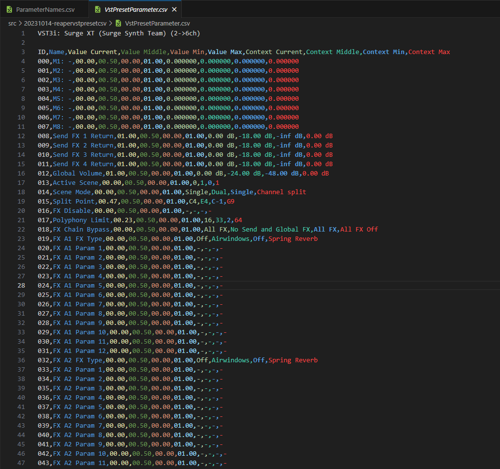

\pagebreak

(c)2023 - hoanglongplanner


This work is licensed under CC BY-SA 4.0

# Table of Contents
- [Table of Contents](#table-of-contents)
- [Links](#links)
- [References](#references)
- [Video Showcase](#video-showcase)
- [Introduction](#introduction)
- [Acknowledgement - Disclaimer - Limitation](#acknowledgement---disclaimer---limitation)
- [Code Breakdown](#code-breakdown)
  - [Get Values from Track](#get-values-from-track)
  - [Parameter Values](#parameter-values)
  - [Context Values](#context-values)
  - [Append to array](#append-to-array)
  - [Export to](#export-to)

# Links

- [https://github.com/hoanglongplanner/share-blog/tree/main/doc](https://github.com/hoanglongplanner/share-blog/tree/main/doc)
- [https://github.com/hoanglongplanner/share-blog/blob/main/doc/hoanglongplanner-ReaperVSTPresetCSV.pdf](https://github.com/hoanglongplanner/share-blog/blob/main/doc/hoanglongplanner-ReaperVSTPresetCSV.pdf)
- [https://github.com/hoanglongplanner/share-blog/tree/main/src](https://github.com/hoanglongplanner/share-blog/tree/main/src)
- [https://github.com/hoanglongplanner/share-blog/tree/main/src/hoanglongplanner-ReaperVSTPresetCSV](https://github.com/hoanglongplanner/share-blog/tree/main/src/hoanglongplanner-ReaperVSTPresetCSV)
- [https://youtu.be/ir-Vk7YBjHo?si=2MeEDHw0jYWVCrbS](https://youtu.be/ir-Vk7YBjHo?si=2MeEDHw0jYWVCrbS)

# References

- [https://www.cockos.com/EEL2/](https://www.cockos.com/EEL2/)
- [https://www.cockos.com/reaper/sdk/reascript/reascripthelp.html](https://www.cockos.com/reaper/sdk/reascript/reascripthelp.html)
- [https://forum.cockos.com/showthread.php?t=180466](https://forum.cockos.com/showthread.php?t=180466)
- [https://forum.cockos.com/showthread.php?t=132627](https://forum.cockos.com/showthread.php?t=132627)
- [https://forum.cockos.com/showpost.php?p=2249924&postcount=447](https://forum.cockos.com/showpost.php?p=2249924&postcount=447)

\pagebreak

# Video Showcase

[https://youtu.be/ir-Vk7YBjHo?si=2MeEDHw0jYWVCrbS](https://youtu.be/ir-Vk7YBjHo?si=2MeEDHw0jYWVCrbS)

# Introduction

Tldr: Use Reaper to get all parameters of a VST in the 1st track and export those values to CSV and TXT.

This script was written as ELL2 format that Reaper support. More info can be found at [https://www.cockos.com/EEL2/](https://www.cockos.com/EEL2/) with ReaScript API [https://www.cockos.com/reaper/sdk/reascript/reascripthelp.html](https://www.cockos.com/reaper/sdk/reascript/reascripthelp.html)

Use cases:

- Archival purpose, export VST parameters into raw readable format text
- For use in other audio software products (if possible)

This script able to export to following formats:

- CSV
- TXT
- From then on, you can use 3rd party libraries to convert to other formats (JSON, XML, etc...)

# Acknowledgement - Disclaimer - Limitation

This code was written by users, on Reaper forum post. I make changes to better suited for purposes stated above, the script test okay on Reaper 6.72 / Windows 11.

This script has limitations, since this is just a wrapper script that use Reaper API calls to get these values available publicly

- This is just a spreadsheet with all parameters listed
- In order to really get the real preset of specific plugin, it would have to be the native format is using however sometimes it will be encrypted with unreadable weird symbols and gibberish binary stuffs

Please note: This script will never be accurate, only the native format (XML, JSON, H2P, NMSV, FXP, FXB, etc...) that each audio instrument supports is

To illustrate this inaccuracy I'm talking about, here are some examples

- In H2P preset use for u-he synths, a long string full of numbers and letter, supposedly represent as sample wavetable, which this script cannot extract it from the internal engine of u-he audio instruments
- Some audio instruments will use values as Enum types, so you have to guess what the real context between 0 and 1

\pagebreak

# Code Breakdown

## Get Values from Track

The code below will initialize and set the values by using provided Reaper API functions, in this case we only want to get parameter values from the 1st track only.

```c
RV = TrackFX_GetFormattedParamValue(tr, 0, Pidx, #form_pv);
pval = TrackFX_GetParam(tr, 0, Pidx,  minval, maxval);
pval_ex = TrackFX_GetParamEx(tr, 0, Pidx, minval_ex, maxval_ex, midval_ex);
pval_norm  = TrackFX_GetParamNormalized(tr, 0, Pidx);
RV = TrackFX_GetParameterStepSizes(tr, 0, Pidx, step, smallstep, largestep, istoggle);
```

## Parameter Values

The code below will get parameter values (different from context value), round and automatically append these values into #pv2 array

- parameterValue (current, min, max, middle)
- contextValue (current, min, max, middle)
- step (how much to increase and decrease knob, 0.1 0.01 0.001) (DISCARD)
- isToggle (in theory it should only be 0 or 1) (DISCARD)

Note: DISCARD meaning it won't be present in the new script, I discard these value because they are not helpful at all. (You could compare the old and new CSV files provided in Github repo).

```c
// ! ORIGINAL VERSION
sprintf(#pv2,
"%05.2f, %05.2f, %05.2f, %05.2f, %05.2f, %05.2f, %05.2f, 
%05.2f, %05.2f,%05.2f, %05.2f, %05.2f,\ ",
minval,
maxval,
minval_ex,
midval_ex,
maxval_ex,
step,
smallstep,
largestep,
istoggle,
pval,
pval_ex,
pval_norm
);
```

\pagebreak

```c
// ! NEW VERSION
sprintf(#pv2,
  "%05.2f, %05.2f, %05.2f, %05.2f,\ ", 
  pval_norm,
  midval_ex,
  minval,
  maxval
);
```

## Context Values

The code below will get context values.

These are just hacks to get highest/lowest/middle value by manipulating Reaper to set the 1st track of highest/lowest/middle possible value.

```c
//Reaper Hack to get middle value
TrackFX_SetParam(tr, 0, Pidx, midval_ex);
TrackFX_GetFormattedParamValue(tr, 0, Pidx, #form_def);
#pv2 += ", ";
#pv2 += #form_def;
    
//Reaper Hack to get minimum value
TrackFX_SetParam(tr, 0, Pidx, minval_ex);
TrackFX_GetFormattedParamValue(tr, 0, Pidx, #form_min);
#pv2 += ", ";
#pv2 += #form_min;
    
//Reaper Hack to get maximum value
TrackFX_SetParam(tr, 0, Pidx, maxval_ex);
TrackFX_GetFormattedParamValue(tr, 0, Pidx, #form_max);
#pv2 += ", ";
#pv2 += #form_max;
```

\pagebreak

## Append to array

All value items in #pv2 array will be appended to #pvalues

```c
#pvalues += #pv2; 
```

## Export to

The code below specify where Reaper should export those VST parameters to (CSV and TXT), please change this to suit your own need. By default, Reaper will export at the script folder.


```c
//--FilePath--
K_FileLocation_CSV = "/Scripts/VstPresetParameter.csv"; 
K_FileLocation_TXT = "/Scripts/VstPresetParameter.txt";
ParseTo(K_FileLocation_CSV);
ParseTo(K_FileLocation_TXT);
```