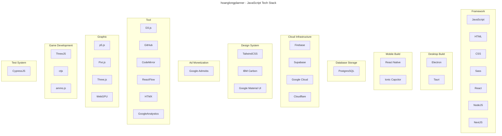

# Table of Contents
- [Table of Contents](#table-of-contents)
- [Tech Stack](#tech-stack)
- [Overview JavaScript](#overview-javascript)
- [C \& C++](#c--c)
- [Production Use Techstack](#production-use-techstack)
- [JavaScript](#javascript)
- [NOT INCLUDED](#not-included)

# Tech Stack

# Overview JavaScript

# C & C++

- fmt

# Production Use Techstack

# JavaScript

# NOT INCLUDED

- MonacoEditor
- CoffeeScript
- TypeScript
- JQuery
- Apache Cordova